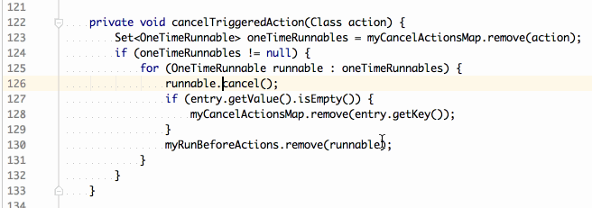

# Missing In Actions

**You can download it on the [JetBrains plugin page].** or
[Download Latest 0.7.0 from this repo]

[TOC]: #

### Table of Contents
- [Version 0.7.0 - Much Improved and Enhanced](#version-070---much-improved-and-enhanced)
- [Why the need](#why-the-need)
    - [Multi Caret Friendly Actions](#multi-caret-friendly-actions)
    - [Auto Indent Lines after Move Lines Up/Down](#auto-indent-lines-after-move-lines-updown)
    - [Auto Line Selections](#auto-line-selections)

A collection of useful but missing text editing actions for JetBrains IDEs, including navigation
and selection of start and end of words!

* Next/Previous word Start/End variations based on what marks a word boundary:
    * IDEA version: identifier characters, spaces, lexeme boundaries
    * Words Only: identifier characters, spaces, all the rest
    * Identifiers Only: identifier characters, all the rest
    * Customized: select your combinations for start/end/start and end of word and more.

* Actions to delete to line indent, to clear to line indent (replace all chars from caret to
  line indent with spaces, delete and backspace spaces only. Useful to pull jagged text straight
  with multi-carets.

* Auto Line Selection mode and supporting actions to automatically switch selection to full line
  mode if selection spans more than one line.
    * Actions to switch from Auto Line selection to character based selection
    * Auto line selection mode for mouse selections
    * Auto line selection multi-caret friendly actions that will not move carets to another
      line:
        * Next/Prev word stops at beginning and end of line for the caret
        * Delete to End of Line will not delete that line's EOL when , causing it to join two
          lines

* Multi-caret and selection manipulation functions: 
    * Toggle from selection to carets and back
    * Remove carets from blank lines or non-blank lines
    * Straighten carets 
    * Switch selection direction to change the other end of the selection

* Many optional improvements to built in functions:
    * Remove selection created by toggle case action
    * Keep Selection of pasted text so you can edit it by switching to multi-carets with the
      selection to carets toggle action.
    * Allow Duplicate Selection to duplicate above selected text if the selection was made
      bottom up.
    * Auto Indent Lines after moving lines up or down, with a settable delay so it won't slow
      you down.
    * Toggle CamelHumps mode

## Version 0.7.0 - Much Improved and Enhanced

[Version Notes]  
[Download Latest 0.7.0 from this repo] 

## Why the need

IntelliJ development tools are the best of breed when it comes to language support, refactoring
and the rest of intelligent language features but I find they suffer in their text editing
capabilities, especially when it comes multiple caret editing.

I wrote and maintained my own editor for over two decades, on the Amiga, then PC DOS then
Windows (3.1 to Vista), only because I could not find the functionality I needed elsewhere. When
I started development on a Mac I no longer wanted to maintain that old war horse which was
getting long in the tooth. I was sure that I was not going to rewrite it for the Mac and decided
that I will give it up and get used to IntelliJ way of editing.

I made the switch but found for some bulk edits I still prefer to fire up Parallels Desktop with
Windows 10 and do the edit in my old workhorse. It was getting harder to use every time because
some things no longer worked under Windows 10 and then horror! The old workhorse stopped working
after a Windows 10 upgrade. I decided it was time to bite the bullet and make a plugin that will
add to IntelliJ what it doesn't know it's missing.

### Multi Caret Friendly Actions

Refactoring and code smarts are great but often a good multi-caret editing will be so much
faster, and sometimes it will be the only way to get it done without having to do a lot of
typing and editing.

All editing actions can be used in multi caret mode but to be really useful actions should not
be too aggressive in their operation. What makes sense when you are editing with a single caret
can quickly turn into a disaster when editing on multiple lines and with different text content.

Standard editing actions make multi-caret mode barely useful and only for a few keystrokes
before your multiple carets are turned into a jumbled mess.

This plugin adds multi caret aware actions:

* Next/Prev word start/end actions will not cross line boundaries in multi-caret mode. They will
  stop at column one or the end of line. This ensures that you always know where your carets
  are, on the line where you put them.

    These come with variation on what they consider to be a word boundary:

    * Java identifier characters, whitespace and all the rest
    * Java identifier characters and the rest. Use these to jump to identifiers
    * Custom version which you can tweak for what they will consider a boundary on which to stop.

* Delete to End of Line that does not delete the EOL character, which the standard IDEA action
  does, causing the lines where the caret is located at the end of line, or after it, to be
  spliced to the next line.

    For multi caret operation this is not desired because it causes some lines to be spliced
    while others get truncated as the action implies. The action provided by this plugin will
    only delete the text, making it useful for truncating all lines without splicing them.

    If you want to splice them use Join Lines action provided by the IDE.

* Delete to Indent to delete characters between caret and the line's indent

* Clear to Indent to replace characters between caret and line's indent with spaces. Effectively
  removes all text before caret and indents the line to the caret position.

* Toggle between a selection and multiple carets, variations when switching to multiple carets:
    * carets on all lines
    * carets on non-blank lines only
    * carets on blank lines only

* Caret filter actions:
    * Remove carets on blank lines
    * Remove carets on non-blank lines

* Straighten carets action to move all the carets to the same column position.

* Switch selection direction allows you to switch the anchor of the current selection. Useful
  when you selected the desired text only to notice you want to change the other end of the
  selection. Switching direction will move the caret to the other end so you can proceed with
  the change.

### Auto Indent Lines after Move Lines Up/Down

Line Move up/down is great but Auto Indenting them is a PITA. I added an option to automatically
indent the moved lines after a short delay. You can configure the delay so that the keyboard
auto repeat on up/done kicks in before the delay runs out. When you pause or invoke another
action the lines will be re-indented.

### Auto Line Selections

When selecting text in source code, most of the time if it spans more than one line then you
want full lines. Instead, all editors work like word processors and select characters forcing
you to move the caret to column 1 to select full lines.

Auto line selection actions selects full lines when using vertical movement selection keys: up,
down, page up, page down. While horizontal keys will restore the selection to character mode,
even if it spans more than one line.

The switching is done by the actions and once your expectations are adjusted you will not want
to work without it.

This works best if you have virtual spaces enabled. It will leave the caret column position
unmolested throughout all line based operations regardless of the actual text length of the
line.

* Switch/Toggle between auto line and normal character selections

#### Mouse Selections

With auto line selections enabled for mouse selections you get full lines when a selection spans
more than one line and character selections for selections within a line.

Use the Ctrl key while selecting to disable auto line selections. Keep the Ctrl key pressed
until after you release the mouse button, otherwise the selection will be changed to a line
selection when the mouse button is released.

[JetBrains plugin page]: https://plugins.jetbrains.com/plugin?pr=&pluginId=9257
[Version Notes]: /resources/META-INF/VERSION.md
[Download Latest 0.7.0 from this repo]: ../../raw/master/dist/MissingInActions.0.7.0.zip

