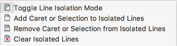
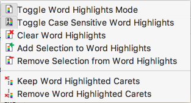
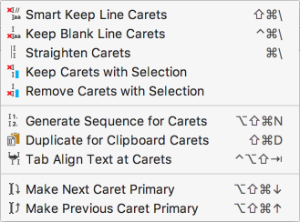
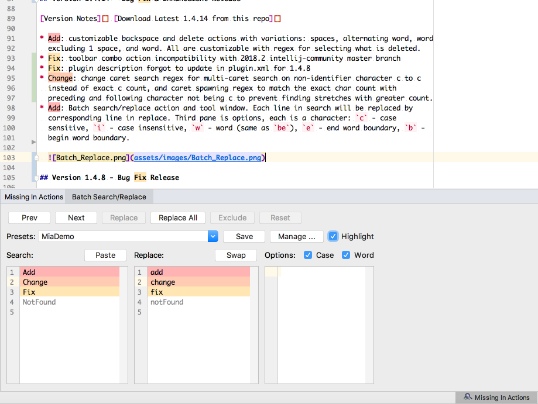
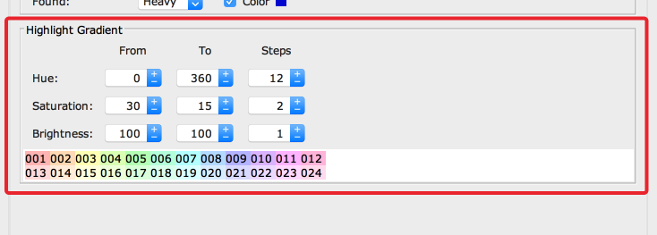
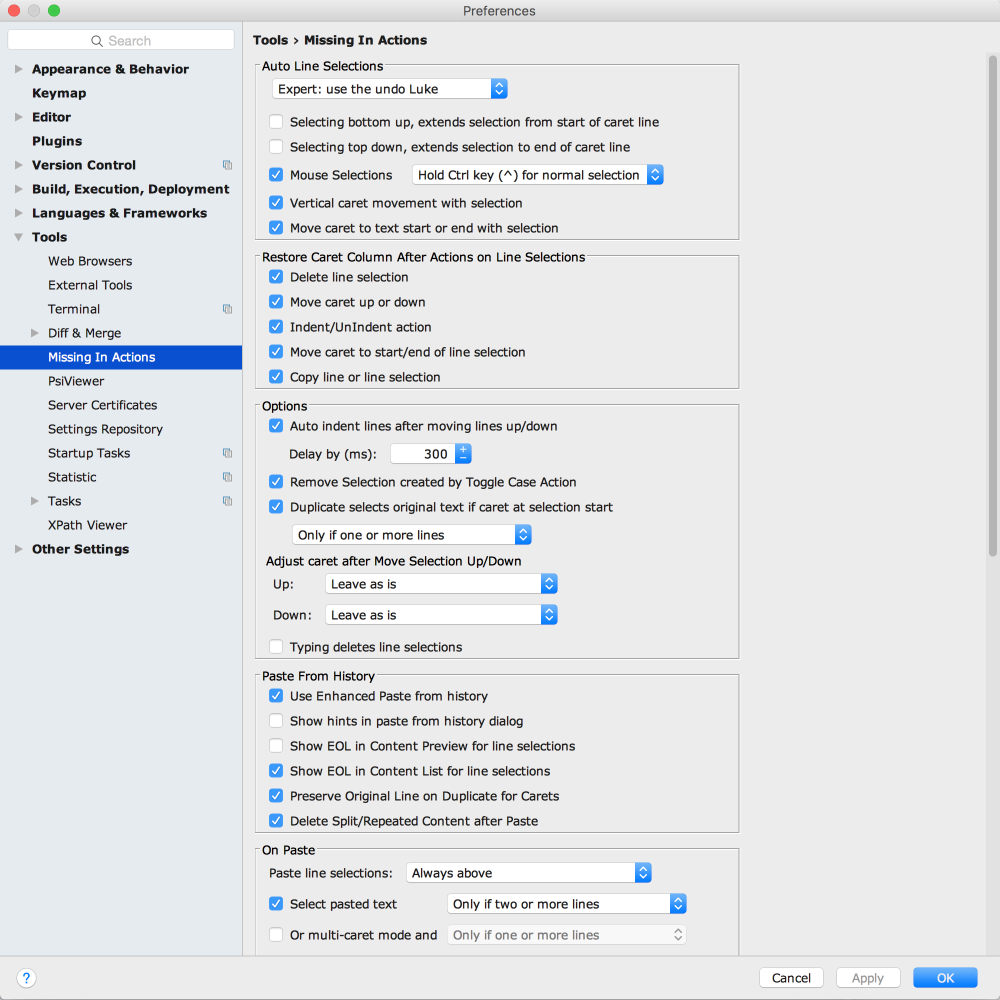
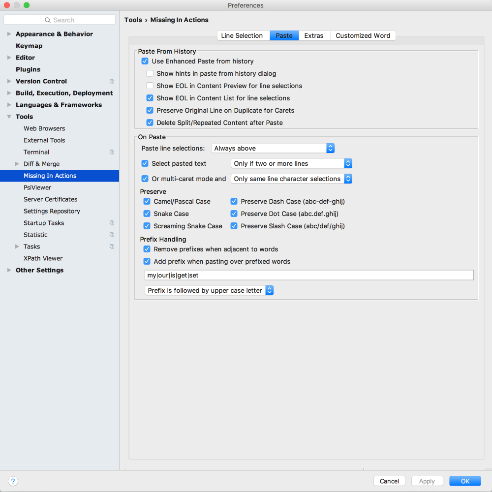
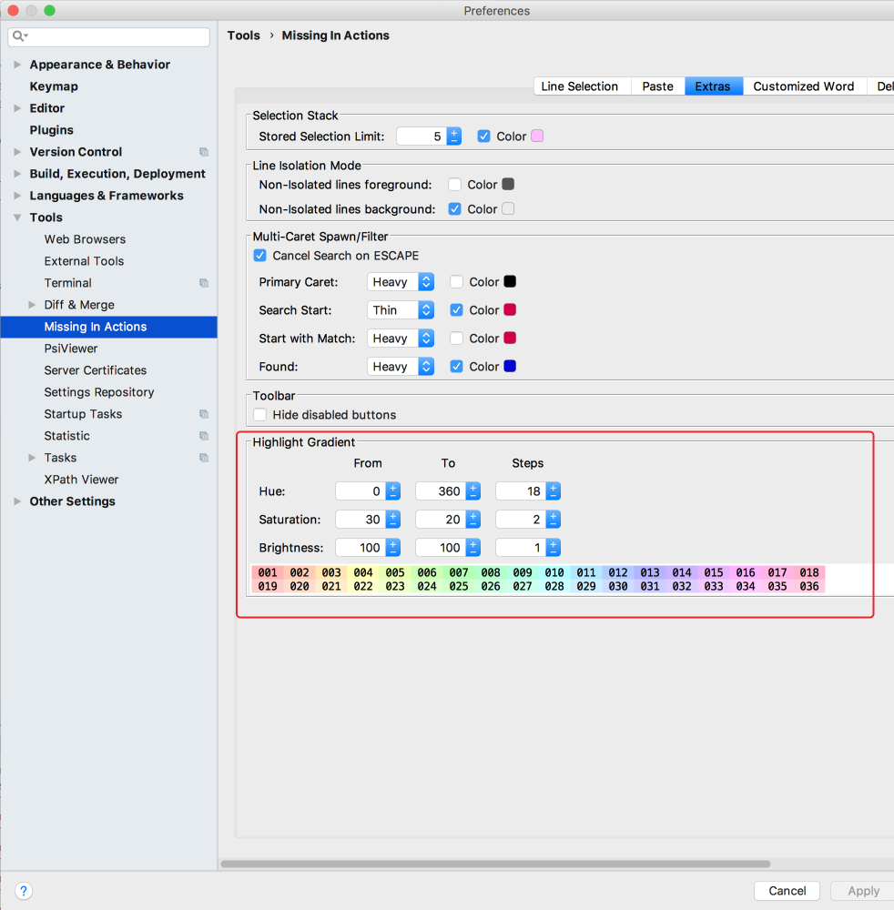
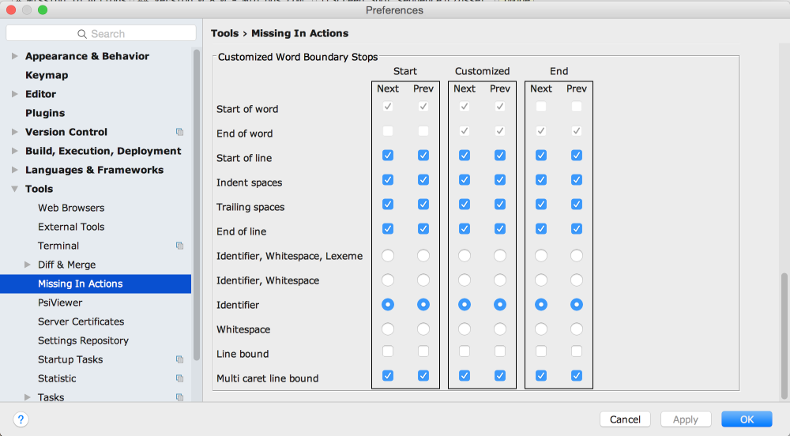
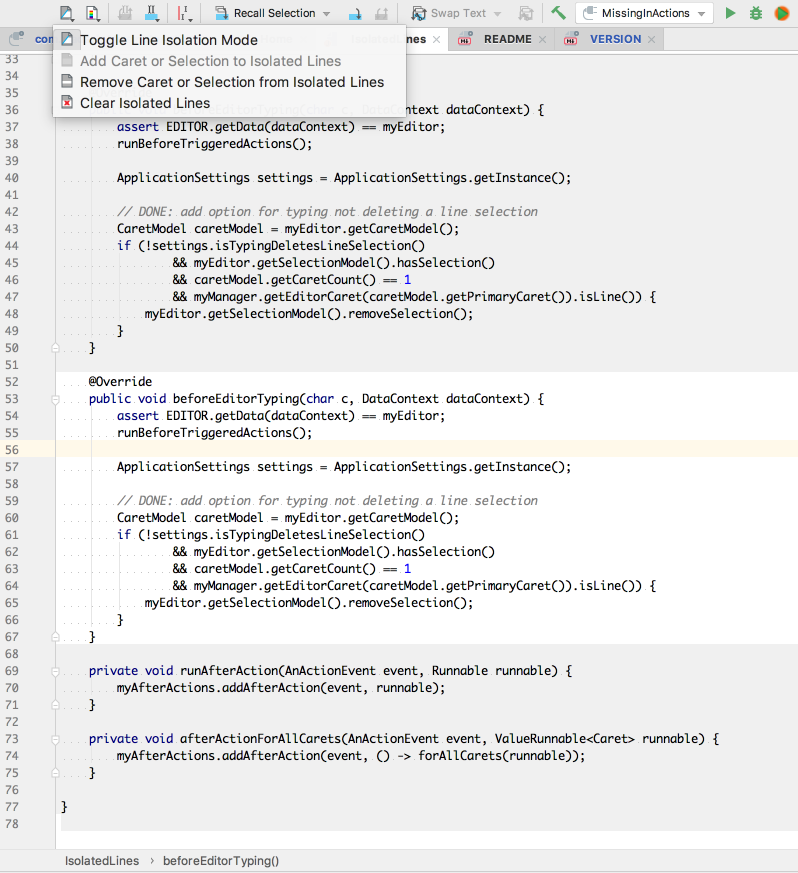

Missing In Actions
================================================================================================================================================================================================

**You can download it on the [JetBrains plugin page].** or
[Download Latest 1.6.18 from this repo]

[](https://gitq.com/vsch/MissingInActions)

[TOC]: #

### Table of Contents
- [Version 1.6.18 - Bug Fix Release](#version-1618-bug-fix-release)
- [Version 1.6.14 - Bug Fix Release](#version-1614-bug-fix-release)
- [Version 1.6.12 - Bug Fix & Enhancement Release](#version-1612-bug-fix-enhancement-release)
- [Version 1.6.10 - Bug Fix & Enhancement Release](#version-1610-bug-fix-enhancement-release)
- [Version 1.6.6 - Bug Fix & Enhancement Release](#version-166-bug-fix-enhancement-release)
- [Version 1.5.0 - Bug Fix & Enhancement Release](#version-150-bug-fix-enhancement-release)
- [Version 1.4.8 - Bug Fix Release](#version-148-bug-fix-release)
- [Version 1.4.6 - Bug Fix Release](#version-146-bug-fix-release)
- [Version 1.4.2 - Bug Fix Release](#version-142-bug-fix-release)
- [Version 1.4.0 - Bug Fix Release](#version-140-bug-fix-release)
- [Version 1.3.4 - Bug Fix Release](#version-134-bug-fix-release)
- [Version 1.3.0 - Bug Fix & Enhancement Release](#version-130-bug-fix-enhancement-release)
- [Version 1.2.3 - Bug Fix & Enhancement Release](#version-123-bug-fix-enhancement-release)
- [Version 1.2.2 - Bug Fix & Enhancement Release](#version-122-bug-fix-enhancement-release)
- [Version 1.2.0 - Enhancement Release](#version-120-enhancement-release)
- [Version 1.1.5 - Enhancement Release](#version-115-enhancement-release)
- [Version 1.1.4 - Enhancement Release](#version-114-enhancement-release)
- [Version 1.1.3 - Enhancement Release](#version-113-enhancement-release)
- [Version 1.0.0 - Bug Fix and Improvement Release](#version-100-bug-fix-and-improvement-release)
- [Version 0.8.3 - Bug Fix and Improvement Release](#version-083-bug-fix-and-improvement-release)
- [Version 0.8.2 - Enhanced Paste From History](#version-082-enhanced-paste-from-history)
- [Version 0.8.0 - Mia has come of age!](#version-080-mia-has-come-of-age)
- [Why Do I Need Mia?](#why-do-i-need-mia)
    - [What you didn't know you were missing](#what-you-didnt-know-you-were-missing)
    - [Auto Indent Lines after Move Lines Up/Down](#auto-indent-lines-after-move-lines-updown)
    - [Auto Line Selections](#auto-line-selections)


Adds missing editor actions for end of word navigation but that is just the beginning:

* Automatic Selection stack, stores last 5 selections by default. Recall last selection or any
  previous selection from a list.

* Isolate Lines mode to make a group of lines stand out from the rest. Handy way to isolate a
  copy of existing method for modification and not accidentally modify the original text instead
  of the copy.

* Enable Auto Indent Lines after move line/selection up or down actions to have them indented
  automatically.

* Use Smart Paste to eliminate case change and prefix edits when pasting identifiers. MIA will
  match case and style of identifier at destination when you paste, undo to get results before
  MIA adjusted them.

  Copy `myColumnData` and paste it over `DEFAULT_VALUE` to get `COLUMN_DATA`, reverse the order
  and get `myDefaultValue`.

  Works when pasting at the **beginning**, **end** and **middle** of identifiers.

  Supports: **camelCase**, **PascalCase**, **snake_case**, **SCREAMING_SNAKE_CASE**,
  **dash-case**, **dot.case**, **slash/case**

  Default prefixes: `my`, `our`, `is`, `get`, `set` to allow pasting over member fields, static
  fields, getters and setters.

* Enable Auto Line Selections and select full lines without loosing time or column position by
  moving the caret to the start of line when selecting or pasting.

  **Choose** whether you want to **paste full line** selections: **above** or **below** the
  current line regardless of the caret's column.

* Toggle between selection and multiple carets on selected lines to save time re-selecting the
  same text again.

* Filter multiple carets saves you time when creating multiple carets by removing carets on
  blank or comment lines so you can edit only code lines.

* Enhanced Paste from History dialog:
  * **combine**, **arrange** and **reverse** the order of content entries
  * **combine multiple** clipboard contents **with caret information intact**
  * **paste and re-create multiple carets** from information already stored on the clipboard
  * **duplicate line/block for each caret** in the clipboard content and **put a caret on the
    first line** of the block, ready for multi-caret select and paste
  * **duplicate line/block for each caret** in the clipboard content for multiple caret
    selections and paste content into each selection
  * see caret information stored on the clipboard for each content entry

* Many more options and adjustments to make multiple caret text editing fast, efficient and
  easy.

## Version 1.6.18 - Bug Fix Release

[Version Notes][] [Download Latest 1.6.18 from this repo][]

* Add: option for spawn carets on digits to use: standard spawn, base 10 digit select, hex
  digit select.

## Version 1.6.14 - Bug Fix Release

* Fix: 2016.3 paste from history compatibility

## Version 1.6.12 - Bug Fix & Enhancement Release

* Fix: for API change in intellij-community/master (upcoming EAP 2018.3 changes)

## Version 1.6.10 - Bug Fix & Enhancement Release

* Add: option "Keep only latest blank clipboard content" in Settings > Missing In Actions >
  Paste. When enabled, only the latest blank clipboard content is kept in history.

  **NOTE:** removal of old blank content is done when empty content is copied to the clipboard.

## Version 1.6.6 - Bug Fix & Enhancement Release

* Fix: batch search/replace window exception in DataGrip, when no project use user home dir.
* Fix: Enable batch replace tool window to work in dumb mode
* Fix: make default directory for export/import batch search replace files, one directory above
  `.idea` if project file parent dir has that name.
* Fix: 2016.3 compatibility
* Add: batch replace word options for error highlight (!) and warning highlight (?) to allow
  flagging error and warnings as search strings
* Add: paste w/o formatting action to multi-paste dialog
* Add: batch replace window test for caret offset being in found range before replacing. Fixes
  issue with mouse click action assigned to
* Add: convert to carets action in paste selection dialog to convert multi-line clipboard
  contents to multi-caret selection.

## Version 1.5.0 - Bug Fix & Enhancement Release

* Add: Select word and move to next/previous word. If caret not on identifier then first move it
  to next/prev identifier then perform action.

* Add: Camel Humps and Different Camel Humps mode versions of custom delete/backspace actions.

* Add: Next/Previous highlighted word action to move caret to next/previous highlighted word

* Fix: batch replace all was too slow trying to use `findPrev()`. Now does does not update
  highlights or caret. Just modifies document.

* Add: Toggle on paste preserve action and setting to disable on paste preserve case
  functionality without having to change the options when it gets in the way.

* Fix: reduce toolbar size by moving most actions to popup menus: isolation, highlights, carets.

  

  
  

  
  

  
  

* Add: customizable backspace and delete actions with variations: spaces, alternating word, word
  excluding 1 space, and word. All are customizable with regex for selecting what is deleted.

* Fix: toolbar combo action incompatibility with 2018.2 intellij-community master branch

* Fix: plugin description forgot to update in plugin.xml for 1.4.8

* Change: change caret search regex for multi-caret search on non-identifier character c to c
  instead of exact c count, and caret spawning regex to match the exact char count with
  preceding and following character not being c to prevent finding stretches with greater count.

* Add: Batch search/replace action and tool window. Each line in search will be replaced by
  corresponding line in replace. Third pane is options, each is a character: `c` - case
  sensitive, `i` - case insensitive, `w` - word (same as `be`), `e` - end word boundary, `b` -
  begin word boundary.

  

## Version 1.4.8 - Bug Fix Release

* Fix: on paste add prefixes would only be honored if remove prefixes was enabled
* Fix: camel case preserve paste, adding a non-letter/digit prefix to not uppercase first letter
  of pasted content. To fix auto prefixing of `$` for php when pasting non-variable name over
  variable.
* Add: Single line caret spawning search now enabled with carets on multiple lines if at least
  one line has more than one caret. This allows the spawning carets to spawn on multiple lines,
  extending usefulness of this beyond single line search spawn.
* Add: Single line caret spawning search now limits the spawned carets to the existing selection
  of the caret, if there is one. This allows spawning carets in a limited text range.
* Add: Smart Keep/Remove carets add remove non-selection carets if both selection and
  non-selection carets exist.
* Add: paste selection dialog options to join lines/multiple caret content and optionally quote
  individual items with open quote, close quote and delimiter text customizable.
* Add: multi-caret actions: keep-carets with selection and keep carets without selection.
* Add: clear isolated lines action to clear isolation. Select All, add to isolated is
  un-intuitive.
* Fix: numbering without selections for carets would mess up selections.
* Fix: exception when inserting number sequence with last caret being on the last line of the
  document without an EOL.
* Change: search spawning caret action when non-identifier or space now will search for a span
  of matching characters. For example caret on `&&` will spawn a caret on every occurrence of
  `&&` instead of just `&` as before which produced a useless result 99% of the time.
* Fix: caret spawning search forward/backward regex when word starts or ends on `$` which regex
  does not consider an identifier character so `\b` does not handle the word break properly.
* Fix: Highlights sorted in reverse length order to allow longer matches to succeed before
  possibly shorter sub-strings.
* Fix: @NotNull argument must not be null exception.

## Version 1.4.6 - Bug Fix Release

* Fix: change "Recall Selection from List" to "Recall Selection" to shorten toolbar real-estate
* Fix: change "Swap Selection Text from List" to "Swap Text" to shorten toolbar real-estate
* Fix: newly opened files would not show word highlights until they were modified.

## Version 1.4.2 - Bug Fix Release

* Add: replacement of content strings on paste:

  * Replace arbitrary string to another string on paste. Useful for quick pasting of template
    code with changes without needing to edit after paste (treat this as a user provided macro
    variable).

    Can add RegEx search or plain string. Plain string search is case sensitive.

  * Add: replace user string on paste and duplicate for every character caret of another
    content. Plain string search is not case sensitive.

    For example: if pasting `int FormatAbc(int abc) { myAbc = abc; return myAbc; } ` with the
    user search string set to `Abc`, with clipboard data for the replacement contains 3 carets
    with `def`, `myHij` and `setKlmnop` then the paste will result in the following being pasted
    in:

    ```
    int FormatDef(int def) { myDef = def; return myDef; }
    int FormatHij(int hij) { myHij = hij; return myHij; }
    int FormatKlmnop(int klmnop) { myKlmnop = klmnop; return myKlmnop; }
    ```

  * Add: Replace Macro Variables on Enhanced paste and on duplicate for carets paste. Currently
    only file name derivations are supported. When pasting in a file with name
    `multi-line-image-url` the following will be changed as shown:

    * `__Filename__` to `multi-line-image-url` (as is)
    * `__FILENAME__` to `MULTILINEIMAGEURL` (uppercase)
    * `__filename__` to `multilineimageurl` (lowercase)
    * `__FileName__` to `MultiLineImageUrl` (pascal case)
    * `__fileName__` to `multiLineImageUrl` (camel case)
    * `__file-name__` to `multi-line-image-url` (dash case)
    * `__FILE-NAME__` to `MULTI-LINE-IMAGE-URL` (screaming dash case)
    * `__file.name__` to `multi.line.image.url` (dot case)
    * `__FILE.NAME__` to `MULTI.LINE.IMAGE.URL` (screaming dot case)
    * `__file_name__` to `multi_line_image_url` (snake case)
    * `__FILE_NAME__` to `MULTI_LINE_IMAGE_URL` (screaming snake case)
    * `__file/name__` to `multi/line/image/url` (slash case)
    * `__FILE/NAME__` to `MULTI/LINE/IMAGE/URL` (screaming slash case)

## Version 1.4.0 - Bug Fix Release

* Fix: NPE when projects are being rapidly opened and closed.

* Fix: #17, Caret don't move across tab-indented lines

* Fix: Remove highlighted word carets would not remove the last selection if all carets
  contained highlighted word selections

* Fix: size of color chip when using HiDPI displays that need scaling.

## Version 1.3.4 - Bug Fix Release

* Fix: #17, Caret don't move across tab-indented lines

* Fix: Remove highlighted word carets would not remove the last selection if all carets
  contained highlighted word selections

* Fix: size of color chip when using HiDPI displays that need scaling.

## Version 1.3.0 - Bug Fix & Enhancement Release

* Fix: #16, Hide disabled buttons breaks Recall Selection List and Swap Selection actions

* Fix: #15, Selection continuation with the mouse and Shift modifier is broken

* Add: multi-caret search accept not found carets action to allow excluding carets with matching
  search position.

## Version 1.2.3 - Bug Fix & Enhancement Release

* Fix: #16, Hide disabled buttons breaks Recall Selection List and Swap Selection actions

## Version 1.2.2 - Bug Fix & Enhancement Release

* Fix: #15, Selection continuation with the mouse and Shift modifier is broken

* Add: multi-caret search accept not found carets action to allow excluding carets with matching
  search position. 

## Version 1.2.0 - Enhancement Release

* Change: make `Line Selection Mode`, `Forward Search Caret Spawning` and `Backward Search Caret
  Spawning` actions toggle actions to show when active.

* Fix: line selections not working in editor text fields in settings

* Add: Word Highlighting Actions. This allows highlighting words based on selections in one file
  across all files in the IDE and to keep or remove carets bases on whether their selections are
  equal to a highlighted word.
  * Toggle highlight word mode
    : turns highlighted
    words on/off. Can be used to turn off highlights without clearing highlight word list.
  * Toggle highlight word case sensitive mode
    :
    toggles highlight word case sensitive matching on/off.
  * Clear highlighted words :
    clears all highlighted words.
  * Add selection to highlighted words
    : adds the current carets'
    selection to list of highlighted words.
  * Remove selection from highlighted words
    : removes the current
    carets' selection from list of highlighted words.
  * Keep carets whose selections are highlighted words
    : removes
    all carets without selection or whose selection text is not a highlighted word.
  * Remove highlighted words from caret selections
    :
    removes all carets whose selection text is a highlighted word.
  * Setting allows to define the background colors to be used for highlighted words based on
    hue, saturation and brightness boundaries and steps.

    

## Version 1.1.5 - Enhancement Release

* Change: Recall selection from list action text from `Recall Selection` to `Selections` to
  shorten the toolbar button.

  

* Change: split settings into tabbed pane per category

  |                                                    |                                                          |                                                           |                                                           |
  |----------------------------------------------------|----------------------------------------------------------|-----------------------------------------------------------|-----------------------------------------------------------|
  |  |  |  |  |

## Version 1.1.4 - Enhancement Release

* Add: Line Isolation Mode to "highlight" the isolated lines by "lowlighting" the non isolated
  lines. Especially useful when duplicating a method or methods for modification. This allows
  isolating the copies which are to be modified so that they are not confused with the
  originals.

  

* Add: Dark scheme color persistence. Colors in settings reflect the current Dark/Light scheme
  selection.

## Version 1.1.3 - Enhancement Release

* Change: allow overlapping selection text swapping by eliminating overlapping part of
  selections from the swap.

* Fix: exception in some cases when swapping text and more than set limit of stored selections
  is already present.

* Fix: bump up version compatibility to 162.*

* Fix: exception caused by api change

* Add: Selection Stack to automatically store the last N selections for a file

* Add: Recall/Swap selection actions and toolbar buttons

* Add: Swap Selection Text actions and toolbar buttons to swap currently selected text with text
  from a stored selection.

## Version 1.0.0 - Bug Fix and Improvement Release

* Change: make MIA application settings shared so that they can be imported and exported.

* Add: `Tab Align Text at Carets` to push non-whitespace text after each caret so that all
  carets are aligned and on a tab stop. Quick way to tab align jagged carets and following text.

* Add: MissingInActions toolbar

  

* Add: **dash-case**, **dot.case** and **slash/case** to on paste preservation options

* Add: number generating action. For now only for multiple carets:
  
  * Sequences 0-9, A-Z for number bases 2-36
  * Prefix/Suffix options to add to generated number
  * Sequences can be 0 or space right justified to any width
  * Arithmetic or Shift with Step and Direction
  * Start/Stop number, carets whose number is outside the range insert nothing

  

* Add: forward/backward caret spawn/filter pattern actions: `Backward Search Caret Spawning`
  , `Forward Search Caret Spawning`
   pattern search and action results are
  based on context and number of carets:
  * if a single caret exists then:
    * if caret is at ' ' or '\t' then will spawn a caret after every span of spaces that ends on
      a non-space. Will select the intervening spaces for each caret
    * if caret is on identifier start then will spawn a caret for every occurrence of identifier
      and select the identifier.
    * if caret is on identifier character, but not start of identifier, then will spawn a caret
      for every occurrence of identifier that ends in same text as one from caret to end of
      identifier and select the matched identifier portion
    * otherwise will spawn a caret on every occurrence of the character at caret, selecting
      trimmed intervening characters between carets.
  * if multiple carets exist then spawning of only a single carets is done by using the pattern
    as determined by the primary caret per above rules with addition of hex (with or without 0x
    prefix), decimal or octal will search for numeric sequence.

    For each caret the pattern search is applied and if found a caret is placed at the location.
    Original caret position is treated as search start positions and match location is called
    the found caret position.

    Start positions are affected by caret movement actions and the pattern search applied at the
    new location. This allows the search start to be modified after the pattern is set.

    Found positions will be the only carets that remain on any non-caret movement actions or on
    typing a character.

    This functionality allows creating a set of carets on all lines and then filtering and
    changing the location of carets used for editing by matching a pattern at the primary caret
    location.

    Caret search options with dialog to show preview of caret search by pattern and ability to
    tweak some search options: .

    

    :warning: Only in IDE versions **2017.1 EAP** and newer the plugin allows changing the caret
    appearance for: primary, start and found carets making it easy to see where the search
    starts and where the pattern is matched. Plugin configuration settings under settings in
    Tools > Missing In Actions:

    
  * behavior is also affected by number of carets and selection:
    * if no selections that spans lines then action is limited to a single line of the caret
    * if no two carets are on the same line then affected range for each caret is expanded to
      full lines
    * any selection for a caret is used to expand the range for that caret to include the
      selection and caret offset.

  For best use, define two shortcuts: one for forward spawning action and one for backward one.
  I was used to having these on my Ctrl+Tab for forward and Ctrl+Shift+Tab for backward search.
  Since these are taken on OS X, I assigned `⌥⌘⇥` for forward and `⌥⌘⇧⇥` for backward
  spawning search instead. A bit awkward but usable.

## Version 0.8.3 - Bug Fix and Improvement Release

* Add: Dupe for Clipboard carets to handle multi-caret input:
  * duplicated block spans all carets
    * if have selections
      * then only keep carets with selections
    * otherwise
      * if span == 1, keep all carets
      * if have no selections
        * if same number of carets on each type of line:code, comment, blank, of the block then
          keep all carets
        * otherwise, assume that the first and last caret were used to mark the span of lines to
          duplicate, and remove them, duplicating the rest of the carets
    * clipboard data is duplicated for every caret so that the first block will have first caret
      content for every caret in the block, second second, etc

    If there are 3 carets with text1, text2 and text3 on clipboard and 3 carets in the line then
    after dupe, the clipboard will contain 9 carets:
    text1,text1,text1,text2,text2,text2,text3,text3,text3

* Fix: improve smart paste and preserve case and prefix

* Fix: on paste add/remove/preserve prefixes now unlimited whether regex or text versions.

## Version 0.8.2 - Enhanced Paste From History

* Enhanced Paste From History Added, [Paste From History: A Power User Feature]


## Version 0.8.0 - Mia has come of age!


## Why Do I Need Mia?

IntelliJ development tools are the best of breed when it comes to language support, refactoring
and the rest of intelligent language features but I find they suffer in their text editing
capabilities, especially when it comes multiple caret editing.

I wrote and maintained my own editor for over two decades, only because I could not find the
functionality I needed elsewhere. When I started development on a Mac, I no longer wanted to
maintain that old war horse which was getting long in the tooth. I was sure that I was not going
to rewrite it for the Mac and decided that I will give it up and get used to IntelliJ way of
editing.

I made the switch but found for some batch edits I still preferred to fire up Parallels Desktop
with Windows 10 and do the edit in my old workhorse. I am now in the process of bringing some of
its features to JetBrains IDEs with my Mia plugin.

### What you didn't know you were missing

This plugin adds multi caret aware actions, line selections, smart paste and seamless switching
between selection and multiple carets:

1. Move caret, with and without selection, to next/previous start/end of word, including a
   customizable set of actions where you can completely tune all the boundary stops these
   actions will make. This has several advantages one of which is that you can quickly and/or
   via shortcuts change the behaviour of word movement and selection keys without having to
   change the key mapping.

2. Automatic line selection mode that works with the rest of the IDE as if it was native. All
   vertical Move with Selection functions will switch to line mode and select full lines,
   horizontal move with selection switches to character based selections. You can mix these as
   the need arises. Multi-line character selections are more involved than before but these are
   rarely used if you have line selections and in trade you get fast line selections without
   needing to constantly move the caret to the left margin.

3. Automatic line selections for the mouse. If you select text within the same line, it is a
   character selection. Select text spanning more than one line and it automatically switches to
   selecting full lines, regardless of the mouse pointer column. You can override this with a
   Ctrl key modifier, allowing old behaviour if you need it or through configuration to reverse
   the modifier function: when pressed line selections, when not pressed character selections.

4. Column position preservation when operating on line selections. This was an exercise in
   catching fleas and herding cats. You'd be surprised how many actions will move the caret to
   column 1 and the myriad of modalities of the IDE that must be taken into account.

5. Paste of full line selections now behaves like line selections should. These can be made to
   paste:

   * IDE default, where you left your caret last

   * always above the caret line (my new favourite),

   * above the caret line if caret is between left margin/indent position and below it
     otherwise,

   * always below the caret line

6. Auto Line Indent on move line or selection up or down. With every other editing operation,
   the IDE seems to remember to adjust indentation automatically, at least as an option. This
   operation was left out of the club for some reason, leaving the code indentation messed up,
   needing a manual intervention. Mia adds an option to re-indent moved lines after a delay.
   Allowing you to rapidly make multiple moves up/down, and re-indent the code to its proper
   level when you pause.

7. Select pasted text to automatically select what you paste so you can apply other operations
   on it. Configuration options include minimum number of lines in the pasted text, below which
   no selection is made.

No more moving to left margin to select or paste full lines of code and loosing the column
position. No more threading the needle in an effort to select full lines with the mouse, and
many more no mores.

The no mores are a productivity boost because these operations get in the way, are complete
editing fluff and are done often. But Mia has a few niceties added that make text editing,
especially in multi-caret mode, a joy:

1. Line bound next/previous word with/without selection when in multi-caret mode. The carets
   will not fly off to other lines. It makes keeping track and controlling their location easy.
   This is key to being able to do extensive multi-caret editing. With IDE supplied functions,
   multiple carets become a jumbled mess after a few keystrokes because they have too much
   freedom of movement.

2. Delete to end of line action that will not delete the EOL at the end of line, ever. The IDE
   provided function will delete to end of line most of the time, but when a caret is already at
   the end of line will delete the EOL, making it useless for multi-caret mode because some
   carets will delete to end of line while others will join lines. If you want to join lines
   then use the join lines action.

3. Seamless switching between line selections and multiple carets on each line using the "Toggle
   Between Carets and Line Selection" action, allowing re-use of already selected text. To me
   selections and multiple carets are just manifestations of me telling the editor what I am
   focusing on. I should be able to switch between the two modes instead of having to re-select
   the lines, again and again.

4. Caret filtering based on the line content: keep code lines, keep comment lines, keep blank
   lines, remove code lines, remove comment lines, remove blank lines with their smart
   counterparts: "Smart Keep Line Carets" which will keep carets only on code lines, if none of
   those exist will keep only carets on comment lines, otherwise no change. To be used for
   quickly placing a caret on every line of code in a selection, ignoring comment lines and
   blank lines.

5. Smart Paste mode that adjusts the case and format of pasted text, if it looks like an
   identifier, to the format of where it is pasted including removal of user configurable
   prefixes such as "my" or "our", if they don't look like they belong in the context. A copied
   member variable name on the clipboard can now be pasted in many places without needing a
   follow up edit, not even a case change. It is like having a mind reading clipboard.

   ![Mia Smart Paste Multi Caret]

   In all cases if you feel that Mia's help was no help, hit undo and you will have results as
   the IDE provided. I don't know if you do these case changes and prefix editing often but I
   found myself doing them ad nauseam. Copy once, use it everywhere is here.

   Every time I use it feels like magic. I know it isn't, I had to write debug the code, but it
   still feels that way.

6. Duplicate Line or Selection for Carets on Clipboard action is a multiple caret user's dream.
   It makes modifying a line or lines for repeated variations an effortless joy. A live example
   from Mia's own source code. I needed variations for several functions based on naming
   convention: camel case, pascal case, snake case and screaming snake case. I already have the
   case names throughout the code. I just need to create a new function with these variations.
   Easy, take existing lines with the case names and use multi-select, copy, select case name in
   destination line, dupe for clipboard, paste.

   ![Mia Dupe For Clipboard Carets]

### Auto Indent Lines after Move Lines Up/Down

Line Move up/down is great but Auto Indenting them is a PITA. I added an option to automatically
indent the moved lines after a short delay. You can configure the delay so that the keyboard
auto repeat on up/done kicks in before the delay runs out. When you pause or invoke another
action the lines will be re-indented.


### Auto Line Selections

When selecting text in source code, most of the time if it spans more than one line then you
want full lines. Instead, all editors work like word processors and select characters forcing
you to move the caret to column 1 to select full lines.

Auto line selection actions selects full lines when using vertical movement selection keys: up,
down, page up, page down. While horizontal keys will restore the selection to character mode,
even if it spans more than one line.

The switching is done by the actions and once your expectations are adjusted you will not want
to work without it.

This works best if you have virtual spaces enabled. It will leave the caret column position
unmolested throughout all line based operations regardless of the actual text length of the
line.

* Switch/Toggle between auto line and normal character selections

#### Mouse Selections

With auto line selections enabled for mouse selections you get full lines when a selection spans
more than one line and character selections for selections within a line.

Use the Ctrl key while selecting to disable auto line selections. Keep the Ctrl key pressed
until after you release the mouse button, otherwise the selection will be changed to a line
selection when the mouse button is released.

[Download Latest 1.6.18 from this repo]: ../../raw/master/dist/MissingInActions.1.6.18.zip
[JetBrains plugin page]: https://plugins.jetbrains.com/plugin/9257-missing-in-actions
[Mia Dupe For Clipboard Carets]: ../../raw/master/assets/images/noload/MiaDupeForClipboardCarets.gif
[Mia Smart Paste Multi Caret]: ../../raw/master/assets/images/noload/MiaSmartPasteMultiCaret.gif
[Paste From History: A Power User Feature]: https://vladsch.com/blog/20
[Version Notes]: /resources/META-INF/VERSION.md

