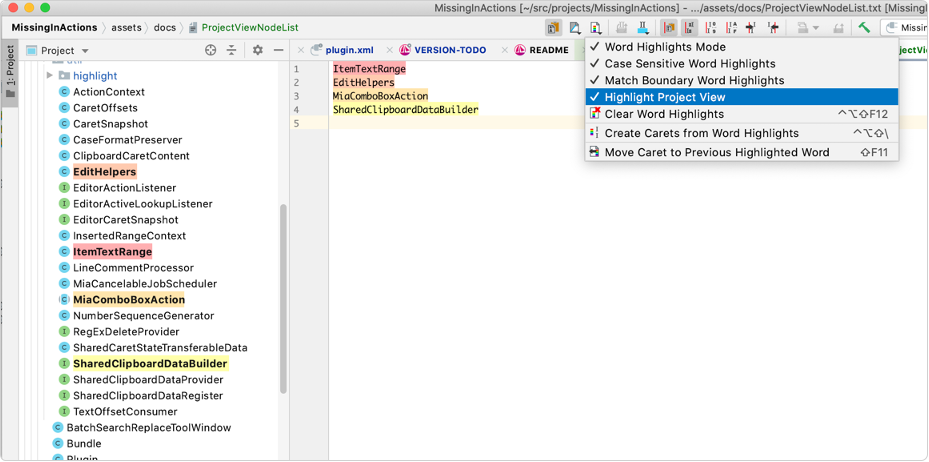

Missing In Actions
======================================================================================================================================================================================================

**You can download it on the [JetBrains plugin page].**

[TOC]: #

### Table of Contents
- [Why Did I Need Mia?](#why-did-i-need-mia)
  - [What You Didn't Know Was Missing](#what-you-didnt-know-was-missing)
  - [Auto Indent Lines after Move Lines Up/Down](#auto-indent-lines-after-move-lines-updown)
  - [Auto Line Selections](#auto-line-selections)
    - [Mouse Selections](#mouse-selections)

Adds missing editor actions for end of word navigation but that is just the beginning:

* Automatic Selection stack, stores last 5 selections by default. Recall last selection or any
  previous selection from a list.

* Isolate Lines mode to make a group of lines stand out from the rest. Handy way to isolate a
  copy of existing method for modification and not accidentally modify the original text instead
  of the copy.

* Enable Auto Indent Lines after move line/selection up or down actions to have them indented
  automatically.

* Use Smart Paste to eliminate case change and prefix edits when pasting identifiers. MIA will
  match case and style of identifier at destination when you paste, undo to get results before
  MIA adjusted them.

  Copy `myColumnData` and paste it over `DEFAULT_VALUE` to get `COLUMN_DATA`, reverse the order
  and get `myDefaultValue`.

  Works when pasting at the **beginning**, **end** and **middle** of identifiers.

  Supports: **camelCase**, **PascalCase**, **snake_case**, **SCREAMING_SNAKE_CASE**,
  **dash-case**, **dot.case**, **slash/case**

  Default prefixes: `my`, `our`, `is`, `get`, `set` to allow pasting over member fields, static
  fields, getters and setters.

* Enable Auto Line Selections and select full lines without loosing time or column position by
  moving the caret to the start of line when selecting or pasting.

  **Choose** whether you want to **paste full line** selections: **above** or **below** the
  current line regardless of the caret's column.

* Toggle between selection and multiple carets on selected lines to save time re-selecting the
  same text again.

* Filter multiple carets saves you time when creating multiple carets by removing carets on
  blank or comment lines so you can edit only code lines.

* Enhanced Paste from History dialog:
  * **combine**, **arrange** and **reverse** the order of content entries
  * **combine multiple** clipboard contents **with caret information intact**
  * **paste and re-create multiple carets** from information already stored on the clipboard
  * **duplicate line/block for each caret** in the clipboard content and **put a caret on the
    first line** of the block, ready for multi-caret select and paste
  * **duplicate line/block for each caret** in the clipboard content for multiple caret
    selections and paste content into each selection
  * see caret information stored on the clipboard for each content entry

* Many more options and adjustments to make multiple caret text editing fast, efficient and
  indispensable.

* Option to use word highlights to highlight Project View nodes. Useful when you have to isolate
  files or directories based on a list and want visual queues in the project view.

  

[Version History][]

## Why Did I Need Mia? ##

IntelliJ's development tools are the best of breed when it comes to language support,
refactoring and the rest of intelligent language features, but I find they suffer in their text
editing capabilities, especially when it comes to multiple caret editing.

I wrote and maintained my own editor for over two decades, only because I could not find the
functionality I needed elsewhere. I was using multi-caret editing, with smart caret adjustments
in my editor since 1998. It spoiled me. I learned to adopt a naming convention and coding style
to facilitate refactoring large blocks of code using multi-caret mode, regardless of the
programming language.

When I started development on a Mac, I no longer wanted to maintain that old war horse which was
getting long in the tooth. I was sure that I was not going to rewrite it for the Mac and decided
that I will give it up and get used to IntelliJ way of editing.

I made the switch but found for some batch edits I still preferred to fire up Parallels Desktop
with Windows 10 and do the edit in my old workhorse. Eventually, I found that I was doing this
was more trouble than it was worth because the editor was becoming incompatible with Windows
updates. I needed a solution on the Mac, and one which would not require me to rewrite my
editor.

I started writing Mia to address a feature request, outstanding for 8 years on YouTrack, asking
to add Mac style next/previous word navigation to IntelliJ. I was surprised to find that the
feature was ignored for so long. I thought it was a no-brainer to implement, which it was. Once
I had a basic plugin to extend the editor, adding the functions I wanted was inevitable.

I have since completed the process of bringing the old editor features to JetBrains IDEs with my
Mia plugin and added many improvements to the originals. There are only two features still
missing:

* Smart Insert Mode: In this mode the editor preserves column aligned text as you edit by
  inserting/deleting spaces down stream in the line to keep column aligned text unmolested. It
  helps if there are tab stops defined for the columns to let the editor know where you want the
  text to be aligned, but not a strict requirement.

* Drag/Drop-Replace: In this mode, dragged text replaces the destination word/identifier/lines
  instead of moving or inserting text at the dropped location. Personally, I find the default
  copy, or worse, move text useless for code editing.

  Once I had drag/drop-replace implemented in my editor, I found I often preferred it for
  replacing identifiers in copied block of source code. In Mia, with its smart paste feature,
  this mode should be even more useful.

### What You Didn't Know Was Missing ###

This plugin adds multi-caret aware actions, line selections, smart paste and seamless switching
between selection and multiple carets, low-lighting of lines, and much more:

1. Move caret, with and without selection, to next/previous start/end of word, including a
   customizable set of actions where you can completely tune all the boundary stops these
   actions will make. This has several advantages one of which is that you can quickly and/or
   via shortcuts change the behaviour of word movement and selection keys without having to
   change the key mapping.

2. Automatic line selection mode that works with the rest of the IDE as if it was native. All
   vertical Move with Selection functions will switch to line mode and select full lines,
   horizontal move with selection switches to character based selections. You can mix these as
   the need arises. Multi-line character selections are more involved than before but these are
   rarely used if you have line selections and in trade you get fast line selections without
   needing to constantly move the caret to the left margin.

3. Automatic line selections for the mouse. If you select text within the same line, it is a
   character selection. Select text spanning more than one line and it automatically switches to
   selecting full lines, regardless of the mouse pointer column. You can override this with a
   Ctrl key modifier, allowing old behaviour if you need it or through configuration to reverse
   the modifier function: when pressed line selections, when not pressed character selections.

4. Column position preservation when operating on line selections. This was an exercise in
   catching fleas and herding cats. You'd be surprised how many actions will move the caret to
   column 1 and the myriad of modalities of the IDE that must be taken into account.

5. Paste of full line selections now behaves like line selections should. These can be made to
   paste:

   * IDE default, where you left your caret last

   * always above the caret line (my new favourite),

   * above the caret line if caret is between left margin/indent position and below it
     otherwise,

   * always below the caret line

6. Auto Line Indent on move line or selection up or down. With every other editing operation,
   the IDE seems to remember to adjust indentation automatically, at least as an option. This
   operation was left out of the club for some reason, leaving the code indentation messed up,
   needing a manual intervention. Mia adds an option to re-indent moved lines after a delay.
   Allowing you to rapidly make multiple moves up/down, and re-indent the code to its proper
   level when you pause.

7. Select pasted text to automatically select what you paste so you can apply other operations
   on it. Configuration options include minimum number of lines in the pasted text, below which
   no selection is made.

No more moving to left margin to select or paste full lines of code and loosing the column
position. No more threading the needle in an effort to select full lines with the mouse, and
many more no mores.

The no mores are a productivity boost because these operations get in the way, are complete
editing fluff and are done often. But Mia has a few niceties added that make text editing,
especially in multi-caret mode, a joy:

1. Line bound next/previous word with/without selection when in multi-caret mode. The carets
   will not fly off to other lines. It makes keeping track and controlling their location easy.
   This is key to being able to do extensive multi-caret editing. With IDE supplied functions,
   multiple carets become a jumbled mess after a few keystrokes because they have too much
   freedom of movement.

2. Delete to end of line action that will not delete the EOL at the end of line, ever. The IDE
   provided function will delete to end of line most of the time, but when a caret is already at
   the end of line will delete the EOL, making it useless for multi-caret mode because some
   carets will delete to end of line while others will join lines. If you want to join lines
   then use the join lines action.

3. Seamless switching between line selections and multiple carets on each line using the "Toggle
   Between Carets and Line Selection" action, allowing re-use of already selected text. To me,
   selections and multiple carets are just manifestations of me telling the editor what I am
   focusing on. I should be able to switch between the two modes instead of having to re-select
   the lines, again and again.

4. Caret filtering based on the line content: keep code lines, keep comment lines, keep blank
   lines, remove code lines, remove comment lines, remove blank lines with their smart
   counterparts: "Smart Keep Line Carets" which will keep carets only on code lines, if none of
   those exist will keep only carets on comment lines, otherwise no change. To be used for
   quickly placing a caret on every line of code in a selection, ignoring comment lines and
   blank lines.

5. Smart Paste mode that adjusts the case and format of pasted text, if it looks like an
   identifier, to the format of where it is pasted including removal of user configurable
   prefixes such as "my" or "our", if they don't look like they belong in the context. A copied
   member variable name on the clipboard can now be pasted in many places without needing a
   follow up edit, not even a case change. It is like having a mind reading clipboard.

   ![Mia Smart Paste Multi Caret]

   In all cases if you feel that Mia's help was no help, hit undo and you will have results as
   the IDE provided. I don't know if you do these case changes and prefix editing often but I
   found myself doing them ad nauseam. Copy once, use it everywhere is here.

   Every time I use it feels like magic. I know it isn't, I had to write debug the code, but it
   still feels that way.

6. Duplicate Line or Selection for Carets on Clipboard action is a multiple caret user's dream.
   It makes modifying a line or lines for repeated variations an effortless joy. A live example
   from Mia's own source code. I needed variations for several functions based on naming
   convention: camel case, pascal case, snake case and screaming snake case. I already have the
   case names throughout the code. I just need to create a new function with these variations.
   Easy, take existing lines with the case names and use multi-select, copy, select case name in
   destination line, dupe for clipboard, paste.

   ![Mia Dupe For Clipboard Carets]

### Auto Indent Lines after Move Lines Up/Down ###

Line Move up/down is great but Auto Indenting them is a PITA. I added an option to automatically
indent the moved lines after a short delay. You can configure the delay so that the keyboard
auto repeat on up/done kicks in before the delay runs out. When you pause or invoke another
action the lines will be re-indented.

### Auto Line Selections ###

When selecting text in source code, most of the time if it spans more than one line then you
want full lines. Instead, all editors work like word processors and select characters forcing
you to move the caret to column 1 to select full lines.

Auto line selection actions selects full lines when using vertical movement selection keys: up,
down, page up, page down. While horizontal keys will restore the selection to character mode,
even if it spans more than one line.

The switching is done by the actions and once your expectations are adjusted you will not want
to work without it.

This works best if you have virtual spaces enabled. It will leave the caret column position
unmolested throughout all line based operations regardless of the actual text length of the
line.

* Switch/Toggle between auto line and normal character selections

#### Mouse Selections ####

With auto line selections enabled for mouse selections you get full lines when a selection spans
more than one line and character selections for selections within a line.

Use the Ctrl key while selecting to disable auto line selections. Keep the Ctrl key pressed
until after you release the mouse button, otherwise the selection will be changed to a line
selection when the mouse button is released.

[JetBrains plugin page]: https://plugins.jetbrains.com/plugin/9257-missing-in-actions
[Mia Dupe For Clipboard Carets]: ../../raw/master/assets/images/noload/MiaDupeForClipboardCarets.gif
<!-- @IGNORE PREVIOUS: link -->
[Mia Smart Paste Multi Caret]: ../../raw/master/assets/images/noload/MiaSmartPasteMultiCaret.gif
<!-- @IGNORE PREVIOUS: link -->
[Version History]: /VERSION.md

