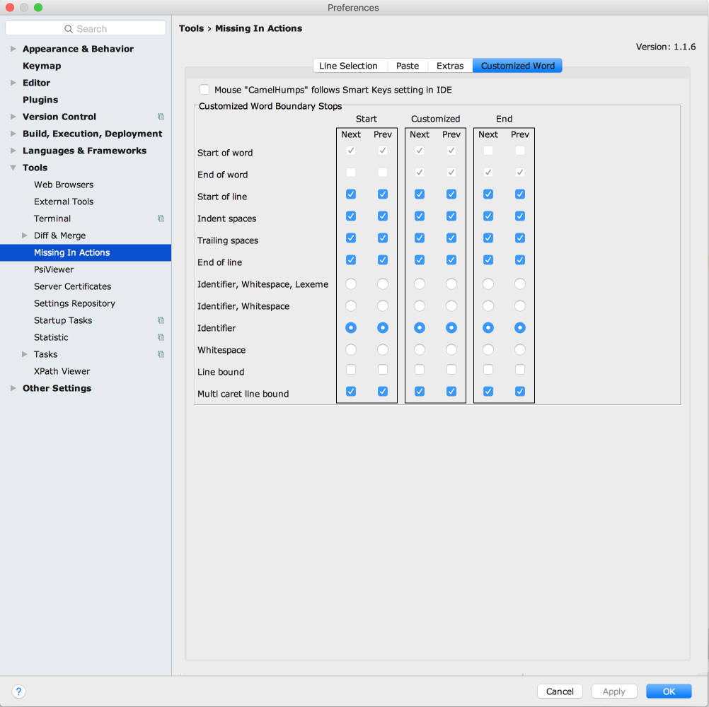

# Missing In Actions

**You can download it on the [JetBrains plugin page].** or
[Download Latest 0.8.0 from this repo]

[TOC]: #

### Table of Contents
- [Version 0.8.0 - Mia has come of age!](#version-080---mia-has-come-of-age)
- [Why Do I Need Mia?](#why-do-i-need-mia)
    - [What you didn't know you were missing](#what-you-didnt-know-you-were-missing)
    - [Auto Indent Lines after Move Lines Up/Down](#auto-indent-lines-after-move-lines-updown)
    - [Auto Line Selections](#auto-line-selections)

A plugin that adds new editing capabilities to the IDE or makes existing ones a lot more
powerful.

* Preserve Case on Paste option that will change the case style of identifier being pasted based
  on where it is pasted. Preserves camel, pascal, snake and screaming snake case of destination
  and optionally removes/adds prefixes like `my` or `our`. Works like magic.

    ![Mia Smart Paste Multi Caret]

* Duplicate line or selection for number of carets on clipboard.

    ![Mia Dupe For Clipboard Carets]

* Auto Line Selection mode and supporting actions to automatically switch selection to full line
  mode if selection spans more than one line.
    * Paste options so that line based clipboard content will be pasted: above or below the
      caret line, regardless of the column position of the caret.
    * Actions to switch from Auto Line selection to character based selection
    * Auto line selection mode for mouse selections
    * Auto line selection multi-caret friendly actions that will not move carets to another
      line:
        * Next/Prev word stops at beginning and end of line for the caret
        * Delete to End of Line will not delete that line's EOL when , causing it to join two
          lines

* Next/Previous word Start/End variations based on what marks a word boundary:
    * IDE version: identifier characters, spaces, lexeme boundaries
    * Words Only: identifier characters, spaces, all the rest
    * Identifiers Only: identifier characters, all the rest
    * Whitespace Delimited: non-spaces, spaces
    * Customized: select your combinations for start/end/start and end of word and more.

     

* Actions to delete to line indent, to clear to line indent (replace all chars from caret to
  line indent with spaces, delete and backspace spaces only. Useful to pull jagged text straight
  with multi-carets.

* Multi-caret and selection manipulation functions:
    * Toggle from selection to carets and back
    * Remove carets from blank lines or non-blank lines
    * Straighten carets
    * Switch selection direction to change the other end of the selection

* Many optional improvements to built in functions:
    * Remove selection created by toggle case action
    * Keep Selection of pasted text so you can edit it by switching to multi-carets with the
      selection to carets toggle action.
    * Allow Duplicate Selection to duplicate above selected text if the selection was made
      bottom up.
    * Auto Indent Lines after moving lines up or down, with a settable delay so it won't slow
      you down.
    * Toggle CamelHumps mode

## Version 0.8.0 - Mia has come of age!

[Version Notes]
[Download Latest 0.8.0 from this repo]

## Why Do I Need Mia?

IntelliJ development tools are the best of breed when it comes to language support, refactoring
and the rest of intelligent language features but I find they suffer in their text editing
capabilities, especially when it comes multiple caret editing.

I wrote and maintained my own editor for over two decades, on the Amiga, then PC DOS then
Windows (3.1 to Vista), only because I could not find the functionality I needed elsewhere. When
I started development on a Mac, I no longer wanted to maintain that old war horse which was
getting long in the tooth. I was sure that I was not going to rewrite it for the Mac and decided
that I will give it up and get used to IntelliJ way of editing.

I made the switch but found for some bulk edits I still preferred to fire up Parallels Desktop
with Windows 10 and do the edit in my old workhorse. It was getting harder to use every time
because some things no longer worked under Windows 10 and then horror! The old workhorse stopped
working after a Windows 10 upgrade.

### What you didn't know you were missing

This plugin adds multi caret aware actions, line selections, smart paste and seamless switching
between selection and multiple carets:

1. Move caret, with and without selection, to next/previous start/end of word, including a
   customizable set of actions where you can completely tune all the boundary stops these
   actions will make. This has several advantages one of which is that you can quickly and/or
   via shortcuts change the behaviour of word movement and selection keys without having to
   change the key mapping.

2. Automatic line selection mode that works with the rest of the IDE as if it was native. All
   vertical Move with Selection functions will switch to line mode and select full lines,
   horizontal move with selection switches to character based selections. You can mix these as
   the need arises. Multi-line character selections are more involved than before but these are
   rarely used if you have line selections and in trade you get fast line selections without
   needing to constantly move the caret to the left margin.

3. Automatic line selections for the mouse. If you select text within the same line, it is a
   character selection. Select text spanning more than one line and it automatically switches to
   selecting full lines, regardless of the mouse pointer column. You can override this with a
   Ctrl key modifier, allowing old behaviour if you need it or through configuration to reverse
   the modifier function: when pressed line selections, when not pressed character selections.

4. Column position preservation when operating on line selections. This was an exercise in
   catching fleas and herding cats. You'd be surprised how many actions will move the caret to
   column 1 and the myriad of modalities of the IDE that must be taken into account.

5. Paste of full line selections now behaves like line selections should. These can be made to
   paste:

    - IDE default, where you left your caret last
    - always above the caret line (my new favourite),
    - above the caret line if caret is between left margin/indent position and below it
      otherwise,
    - always below the caret line

6. Auto Line Indent on move line or selection up or down. With every other editing operation,
   the IDE seems to remember to adjust indentation automatically, at least as an option. This
   operation was left out of the club for some reason, leaving the code indentation messed up,
   needing a manual intervention. Mia adds an option to re-indent moved lines after a delay.
   Allowing you to rapidly make multiple moves up/down, and re-indent the code to its proper
   level when you pause.

7. Select pasted text to automatically select what you paste so you can apply other operations
   on it. Configuration options include minimum number of lines in the pasted text, below which
   no selection is made.

No more moving to left margin to select or paste full lines of code and loosing the column
position. No more threading the needle in an effort to select full lines with the mouse, and
many more no mores.

The no mores are a productivity boost because these operations get in the way, are complete
editing fluff and are done often. But Mia has a few niceties added that make text editing,
especially in multi-caret mode, a joy:

1. Line bound next/previous word with/without selection when in multi-caret mode. The carets
   will not fly off to other lines. It makes keeping track and controlling their location easy.
   This is key to being able to do extensive multi-caret editing. With IDE supplied functions,
   multiple carets become a jumbled mess after a few keystrokes because they have too much
   freedom of movement.

2. Delete to end of line action that will not delete the EOL at the end of line, ever. The IDE
   provided function will delete to end of line most of the time, but when a caret is already at
   the end of line will delete the EOL, making it useless for multi-caret mode because some
   carets will delete to end of line while others will join lines. If you want to join lines
   then use the join lines action.

3. Seamless switching between line selections and multiple carets on each line using the "Toggle
   Between Carets and Line Selection" action, allowing re-use of already selected text. To me
   selections and multiple carets are just manifestations of me telling the editor what I am
   focusing on. I should be able to switch between the two modes instead of having to re-select
   the lines, again and again.

4. Caret filtering based on the line content: keep code lines, keep comment lines, keep blank
   lines, remove code lines, remove comment lines, remove blank lines with their smart
   counterparts: "Smart Keep Line Carets" which will keep carets only on code lines, if none of
   those exist will keep only carets on comment lines, otherwise no change. To be used for
   quickly placing a caret on every line of code in a selection, ignoring comment lines and
   blank lines.

5. Smart Paste mode that adjusts the case and format of pasted text, if it looks like an
   identifier, to the format of where it is pasted including removal of user configurable
   prefixes such as "my" or "our", if they don't look like they belong in the context. A copied
   member variable name on the clipboard can now be pasted in many places without needing a
   follow up edit, not even a case change. It is like having a mind reading clipboard.

    ![Mia Smart Paste Multi Caret]

    In all cases if you feel that Mia's help was no help, hit undo and you will have results as
    the IDE provided. I don't know if you do these case changes and prefix editing often but I
    found myself doing them ad nauseam. Copy once, use it everywhere is here.

    Every time I use it feels like magic. I know it isn't, I had to write debug the code, but it
    still feels that way.

6. Duplicate Line or Selection for Carets on Clipboard action is a multiple caret user's dream.
   It makes modifying a line or lines for repeated variations an effortless joy. A live example
   from Mia's own source code. I needed variations for several functions based on naming
   convention: camel case, pascal case, snake case and screaming snake case. I already have the
   case names throughout the code. I just need to create a new function with these variations.
   Easy, take existing lines with the case names and use multi-select, copy, select case name in
   destination line, dupe for clipboard, paste.

    ![Mia Dupe For Clipboard Carets]

### Auto Indent Lines after Move Lines Up/Down

Line Move up/down is great but Auto Indenting them is a PITA. I added an option to automatically
indent the moved lines after a short delay. You can configure the delay so that the keyboard
auto repeat on up/done kicks in before the delay runs out. When you pause or invoke another
action the lines will be re-indented.

### Auto Line Selections

When selecting text in source code, most of the time if it spans more than one line then you
want full lines. Instead, all editors work like word processors and select characters forcing
you to move the caret to column 1 to select full lines.

Auto line selection actions selects full lines when using vertical movement selection keys: up,
down, page up, page down. While horizontal keys will restore the selection to character mode,
even if it spans more than one line.

The switching is done by the actions and once your expectations are adjusted you will not want
to work without it.

This works best if you have virtual spaces enabled. It will leave the caret column position
unmolested throughout all line based operations regardless of the actual text length of the
line.

* Switch/Toggle between auto line and normal character selections

#### Mouse Selections

With auto line selections enabled for mouse selections you get full lines when a selection spans
more than one line and character selections for selections within a line.

Use the Ctrl key while selecting to disable auto line selections. Keep the Ctrl key pressed
until after you release the mouse button, otherwise the selection will be changed to a line
selection when the mouse button is released.

[Download Latest 0.8.0 from this repo]: ../../raw/master/dist/MissingInActions.0.8.0.zip
[JetBrains plugin page]: https://plugins.jetbrains.com/plugin?pr=&pluginId=9257
[Mia Dupe For Clipboard Carets]: ../../raw/master/assets/images/noload/MiaDupeForClipboardCarets.gif
[Mia Smart Paste Multi Caret]: ../../raw/master/assets/images/noload/MiaSmartPasteMultiCaret.gif
[Version Notes]: /resources/META-INF/VERSION.md

